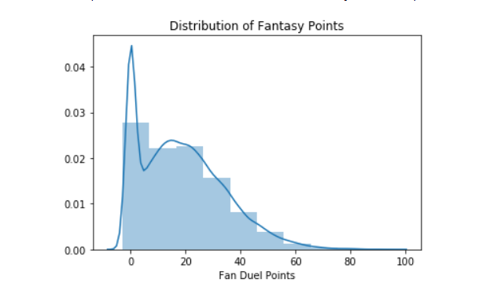
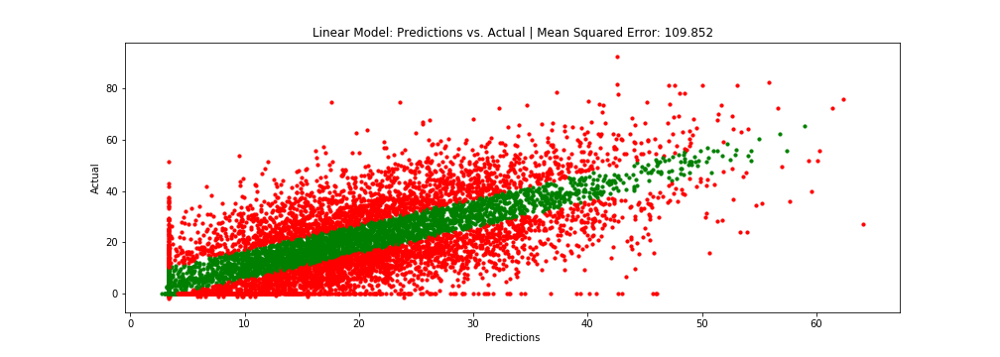
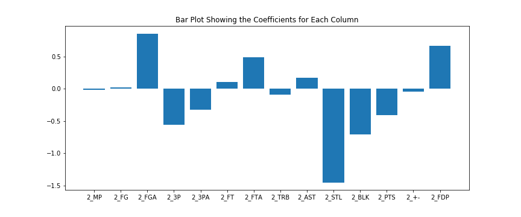
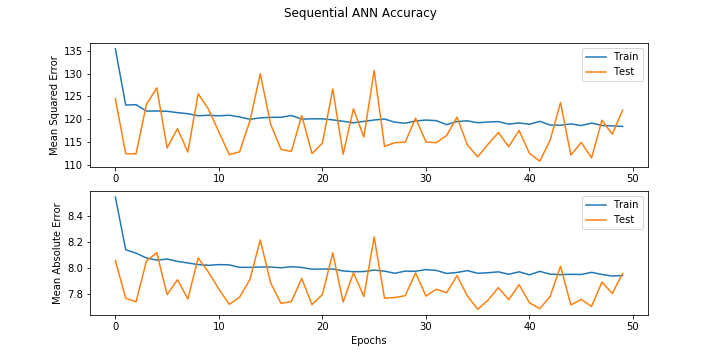
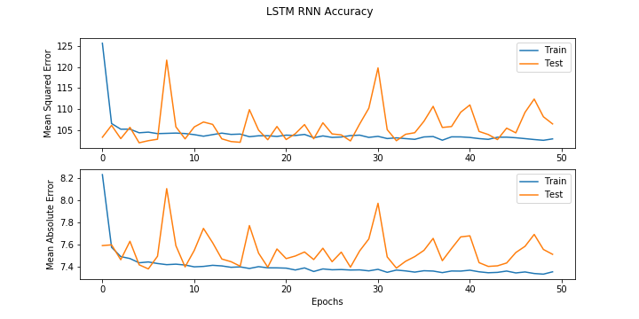

# FantasyBasketbalML
Machine Learning algorithm to predict daily fantasy basketball points.  Utilizes regression and CSP concepts

Visit my blog on medium.com to follow through the entire tutorial! 

https://medium.com/@HeeebsInc/using-machine-learning-to-predict-daily-fantasy-basketball-scores-part-i-811de3c54a98

## Distribution of Fan Duel Points Scored

# Multivariate Linear Regression

# Artificial Neural Network (ANN)

# Recurrent Neural Network (LSTM)

## Comparing Performance
![Performace Comparison Linear, ANN, RNN)

