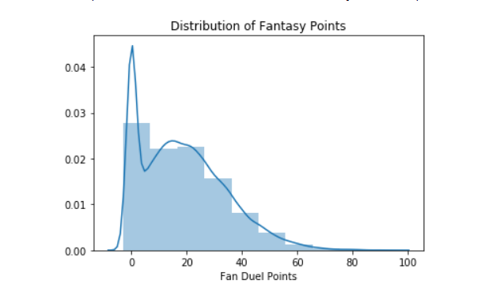
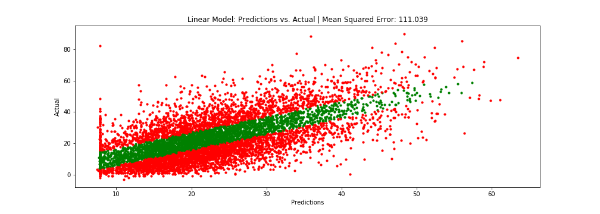
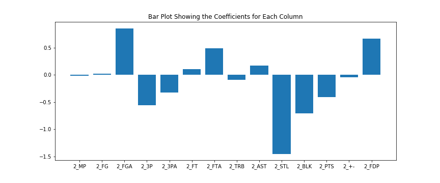
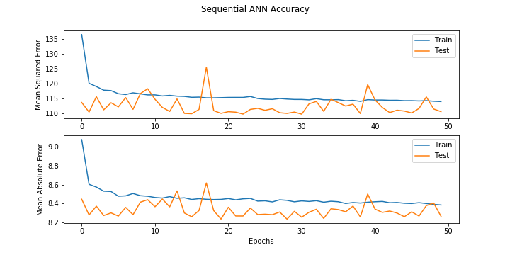
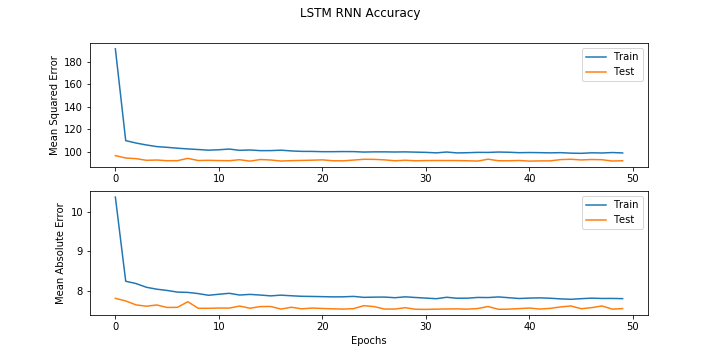
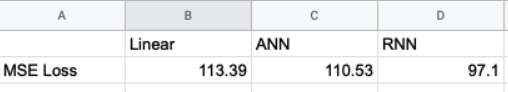

# FantasyBasketbalML
- I am currently working on version two of this implementation.  All the code in the old version can be found [here](Old/)

Machine Learning/AI algorithm to predict daily fantasy basketball points.  Utilizes regression, ANN, and RNN architectures

Visit my blog on medium.com to follow through the entire tutorial! 

https://medium.com/@HeeebsInc

## Distribution of Fan Duel Points Scored

# Multivariate Linear Regression

# Artificial Neural Network (ANN)

# Recurrent Neural Network (LSTM)

## Comparing Performance

